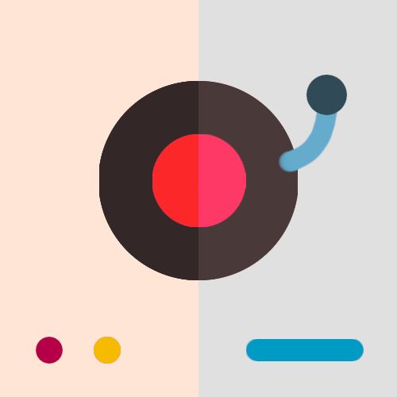
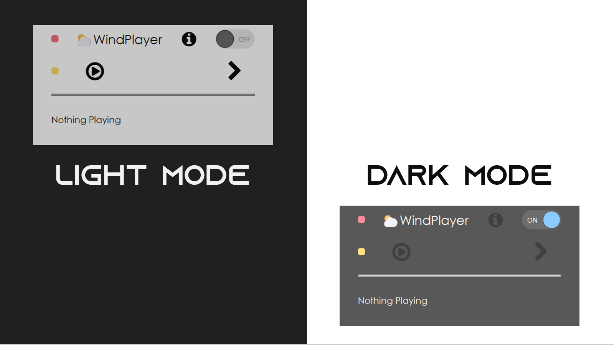
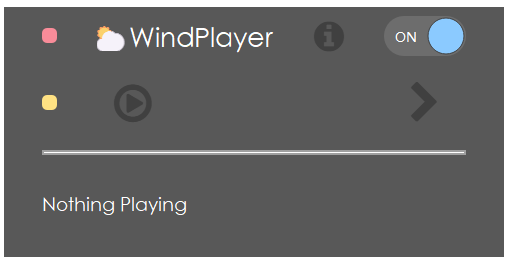
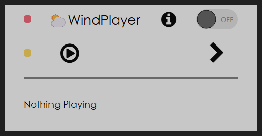

    

<h1 align="center">🌥WindPlayer🌥</h1>

    <em>基于PyQt5的轻量级播放器</em>

    
    
    

    
    
    

# 🎵这是什么

这是一款基于PyQt5开发的音乐播放器，接入了网易云抖音榜API完成曲目推送。设计风格非常简洁，如果不是因为课程作业的缘故还可以再简化一下UI界面。
时间过得好快，没想到已经考研成功了。这次重新弄回这个这个其实是因为课程作业的缘故，毕竟代码量摆在那里还挺难从头开发一个Qt程序的。

    

# ⭐特点

* **极简UI** 傻瓜式操作 ~~让你的工作环境逼格变高~~
* **支持亮/暗模式**，契合当前桌面风格，**保留了一贯的半透明风格**
* **不显示任何歌词、评论**，提高工作专注度
* **不能快进与循环**，但可以切换当前曲目。**每首歌在单次运行时只播放一次。**

# 📸运行截图

    

<h1 align="center">黑暗模式</h1>

    

<h1 align="center">光亮模式</h1>

# ✅Todo List

- [x] 亮暗模式切换
- [ ] 接入GPT实现歌曲推荐
- [ ] 歌单个性化推荐

